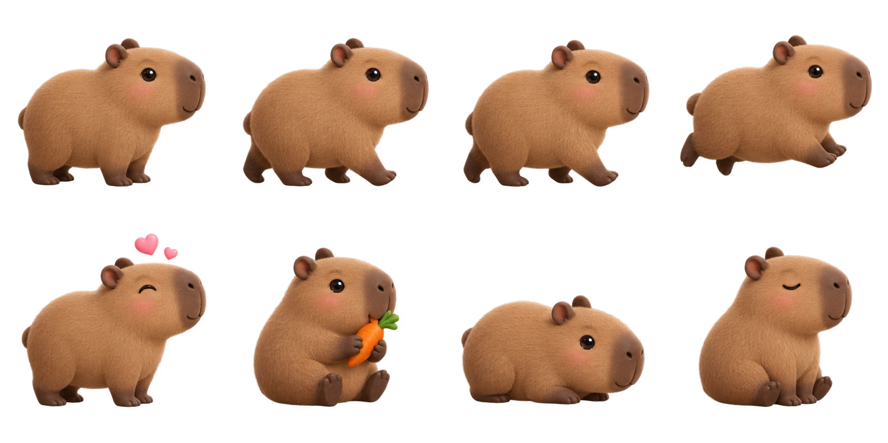
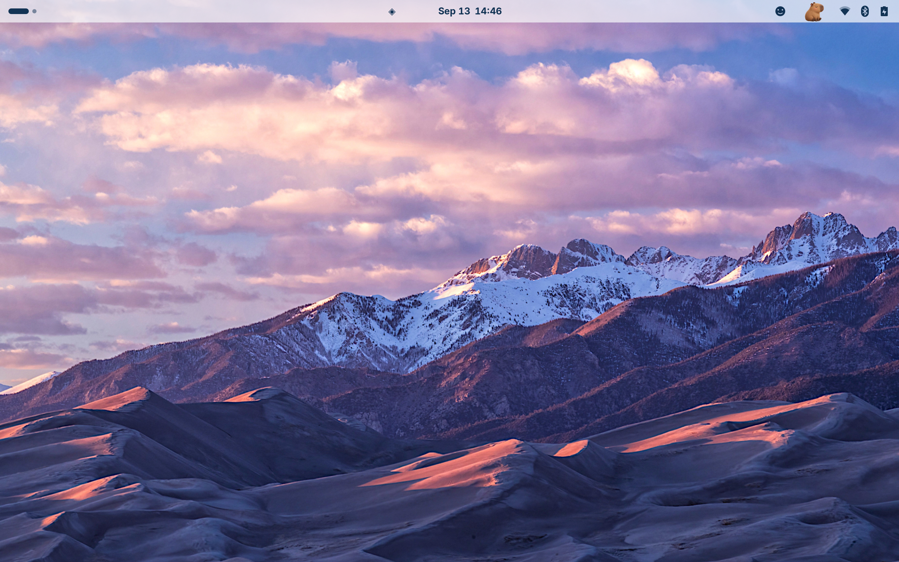

# Top Pet · Your Capybara Panel Companion

**English** | [简体中文](README.zh-CN.md)

A cute capybara living in your Linux top panel. It takes leisurely walks, occasionally breaks into a run, and ducks below icons to pop up on the other side. Pet it, feed it carrots, or play hide-and-seek together.

<p align="center">
  
</p>

**Requires GNOME Shell 46. Primarily developed and tested on Zorin OS 18.** KDE, Xfce and other GNOME versions are not currently supported.

[Download the latest release](https://github.com/perfree/top-pet/releases/latest) · [Changelog (Chinese)](CHANGELOG.md) · [Testing notes (Chinese)](docs/TESTING.md) · [Report an issue](https://github.com/perfree/top-pet/issues)

## Features

- **Walk, run and rest:** Roam through available panel space, turn around at the edges, or stop for a break.
- **Duck and teleport:** Sink completely below the panel, cross an icon, then emerge on the other side. Works in both directions.
- **Make a little room:** Nearby controls gently move aside when icons are crowded. The capybara visits the temporary gap, then the controls return to their original positions. Icons stay within the screen boundaries.
- **Pet and feed:** Petting brings out happy hearts. Feeding a carrot plays an eating animation and restores fullness and mood.
- **Hide-and-seek:** Hide for about 1.8 seconds, then peek out at a random location. Click the capybara to find it.
- **Adaptive sizing:** Match the actual panel height, with no fixed 32px cap and less transparent padding around the artwork, for better visibility on scaled displays.
- **Pause and optional icon movement:** Both are available in the pet menu. The pet hides during the overview or a fullscreen application on the primary monitor.

## Music and encouragement

- With an MPRIS-compatible player, the capybara puts on purple headphones, sways and bounces while playback is active. Pausing restores its usual animation. Playback status is checked about every 2.5 seconds; track titles and media contents are not read. Audio-only apps without MPRIS are not detected.
- Contextual encouragement uses music, recent keyboard activity or general companionship. Bubbles last 5 seconds with a randomized 40–80 second interval and do not intercept clicks. Disable them with **卡皮悄悄话** in the menu.
- On X11, an optional Python 3 / libX11 helper detects whether a key is down, without recording key values, text or window contents, and without network access. It cannot distinguish typing from shortcuts or gaming. On Wayland, keyboard awareness is limited to GNOME Shell itself, not other applications.
- Hide-and-seek prefers locations away from the previous position. Dense icon movement no longer requires extra spacing between controls that originally touched.

## Installation

Check your GNOME version first:

```bash
gnome-shell --version
```

1. Download **`panel-pet@local.shell-extension.zip`** from [Releases](https://github.com/perfree/top-pet/releases/latest). The automatically generated source ZIP is not the extension installer.
2. Open a terminal in your download directory and run:

   ```bash
   gnome-extensions install --force panel-pet@local.shell-extension.zip
   ```

3. Save your work, then **log out and log back in**. Do this after both the first installation and code updates, because GNOME caches extension code within a session.
4. Enable the extension:

   ```bash
   gnome-extensions enable panel-pet@local
   ```

You can also enable **Panel Pet · 顶栏小伙伴** in the GNOME Extensions application. Installation is per-user and does not require `sudo`.

### Controls

The extension's current interface is primarily in Chinese. The menu labels below help you find each action.

| Action or menu label | What it does |
| --- | --- |
| Left-click the capybara | Pet it, or find it during hide-and-seek |
| Right-click the capybara | Open the interaction menu |
| Click the smiley in the panel | Open the menu, even while the pet is hiding |
| 喂一根胡萝卜 — Feed a carrot | Eat and restore fullness and mood |
| 一起追逐 — Play chase | Run around for a while |
| 捉迷藏 — Hide-and-seek | Hide, then peek out at a random location |
| 图标给卡皮让让路 — Make room for the pet | Toggle the icon movement animation |
| 休息一下 — Take a break | Pause or resume activity |

### Disable or uninstall

```bash
# Temporarily disable
gnome-extensions disable panel-pet@local

# Uninstall
gnome-extensions uninstall panel-pet@local
```

## Try it without installing

Download **`top-pet-preview.html`** from a release and open it directly in a browser. No server or internet connection is required.

The preview shares the extension's behavior code and artwork, but its panel is simulated. Moving real icons, music awareness and contextual bubbles require the desktop extension.

## Build from source

Requires **Node.js 18+ and Python 3**. No npm dependencies need to be installed.

```bash
git clone https://github.com/perfree/top-pet.git
cd top-pet
npm test
npm run build
```

Build output:

```text
dist/
├── panel-pet@local.shell-extension.zip  # GNOME extension installer
├── top-pet-preview.html                # Standalone browser preview
└── SHA256SUMS                          # SHA-256 checksums
```

The build also generates `preview.html` in the project root for local preview. To verify downloads, place all three release files in the same directory and run `sha256sum -c SHA256SUMS`.

## Testing and compatibility

The current version passed **20 unit tests and 41 real GNOME integration assertions**. Integration tests run in an isolated GNOME Shell 46 / Wayland session and use virtual mouse input to exercise feeding, teleporting in both directions, icon movement and restoration, hide-and-seek, overview visibility, and enable/disable cleanup.

Display tests use a 2560×1600 virtual display with an internal UI scale of 2. The development desktop runs Zorin OS 18.1 at 2560×1600 with X11 fractional scaling set to 125%. The isolated tests do not cover every X11, display scaling or third-party extension combination. See the [testing notes (Chinese)](docs/TESTING.md) for procedures and results.

<details>
<summary>View icon movement in a real GNOME test session</summary>



</details>

### Current limitations

- Runs only on the primary monitor's native GNOME panel, `Main.panel`. Layouts that replace it with a separate taskbar need additional integration.
- Avoidance uses each control's entire clickable area, so the pet may cross a whole group of icons at once.
- Fullness and mood are stored in memory and reset when the extension is re-enabled.
- With third-party panel themes or extensions, try disabling icon movement to help identify layout conflicts.
- This is an early release. The application interface is primarily in Chinese; the README language switch changes documentation only.

## Troubleshooting

**The extension or capybara does not appear after installation**

Log out and back in, confirm that you are running GNOME 46, then check:

```bash
gnome-extensions info panel-pet@local
```

The extension should be `ACTIVE`. If the panel has no room for the pet, it temporarily hides while the smiley menu remains available.

**An update still looks like the old version**

Log in again to clear GNOME's extension module cache. Simply toggling the extension may not reload its code.

**Reporting a problem**

Include your distribution, GNOME version, resolution, scaling setting and relevant panel extensions in an issue, along with related errors:

```bash
journalctl --user -b -o cat | rg 'panel-pet|PanelPet|JS ERROR'
```

## Project structure

```text
panel-pet@local/
├── extension.js          # GNOME integration, menus, input and textures
├── engine.js             # Behavior state machine and free-space calculation
├── push.js               # Icon displacement planning and boundary checks
├── sprite.js             # Animation selection and browser rendering
├── metadata.json         # GNOME extension metadata
└── assets/               # Transparent character sprite atlas
tests/                    # Unit tests
tools/                    # Build and isolated GNOME integration tests
preview.template.html     # Offline preview template
```

The capybara artwork is AI-generated in a soft 3D style. It does not use Xiaomi's original assets, and this project is not affiliated with Xiaomi.

## Publishing a release

Maintainers update `CHANGELOG.md`, add `docs/releases/vX.Y.Z.md`, commit, and push a `vX.Y.Z` tag. GitHub Actions runs unit tests and builds the artifacts before publishing a release with the installer, offline preview and checksums. The integer `version` in GNOME's `metadata.json` is maintained separately from the GitHub semantic version: the first public release, `v0.1.0`, corresponds to extension version `3`.
